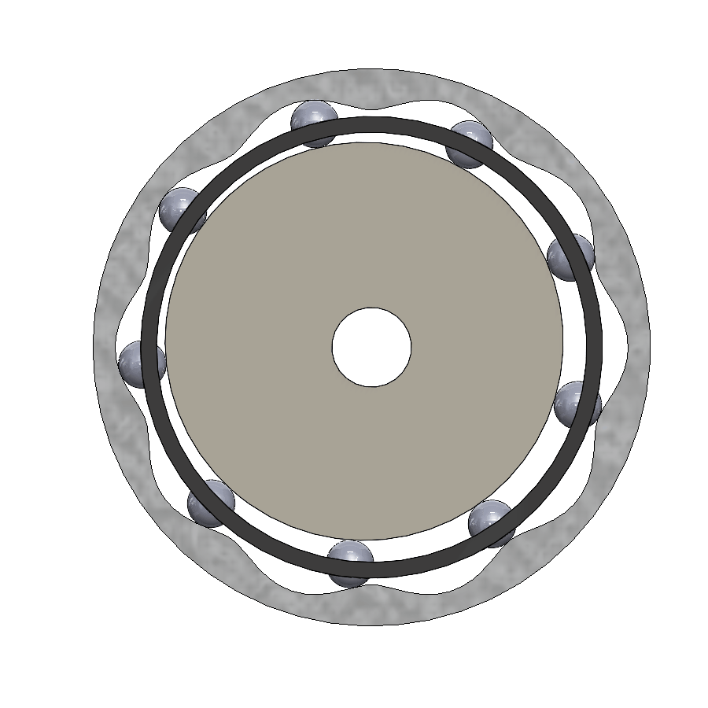
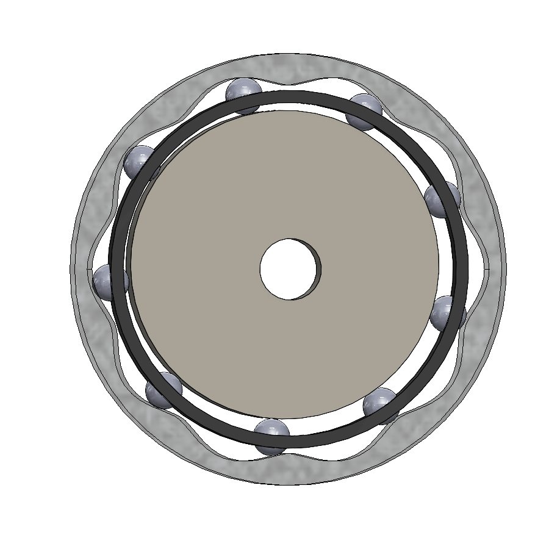

# wave-reducer
Sandbox for generating rolling element wave reducer for robot joints

    

All profile equations came from [this paper [1]](#refences).

## Preventing self-intersecting profile:

- Increase $a + b$: Increase the distance of the rolling elements from the eccentric point (make the crank or roller larger).    
- Reduce $z$: Reduce the number of teeth (though this changes your transmission ratio).    
- Reduce $e$: Reduce the eccentricity (this makes the "wave" shallower).    
- Reduce $b$: Reduce the radius of the rolling elements (this reduces the offset distance $q$).    

## Refences

[1] S. Fritsch, S. Landler, M. Otto, B. Vogel-Heuser, M. Zimmermann, and K. Stahl, “Discussion of a variant of eccentric drives utilizing rolling elements,” Forschung im Ingenieurwesen, vol. 87, pp. 1221–1230, Dec. 2023, doi: 10.1007/s10010-023-00688-1. Access Online: https://link.springer.com/article/10.1007/s10010-023-00688-1